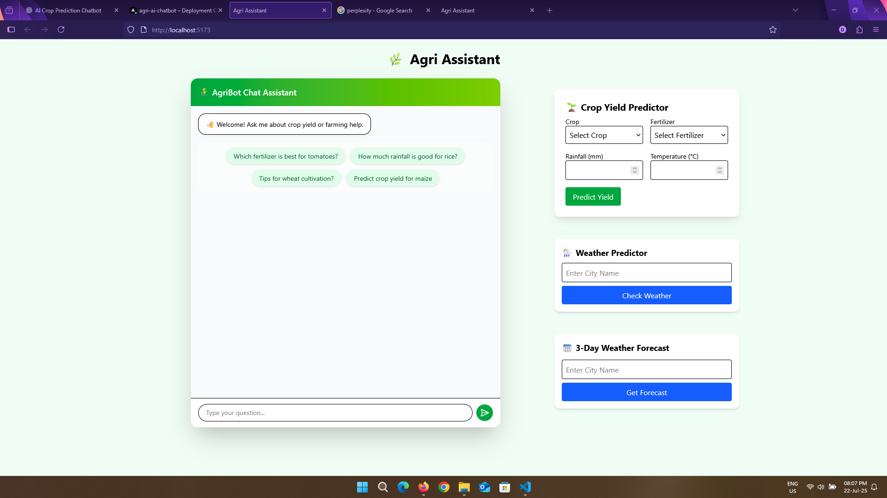

# 🌾 Agri AI Chatbot

Created By Drumil Patel🔥

A smart farming chatbot that helps predict crop yield and answer common agriculture queries using React, FastAPI, and Gemini AI.

## ✨ Features
- 🤖 Chatbot powered with Gemini 2.0 Flash
- 📈 Crop yield prediction using a trained ML model (Scikit-learn)
- 🌿 Smart suggestions for crops, fertilizer, and water
- 💬 React + Tailwind frontend, FastAPI backend
- 🌐 Full-stack deployment (Vercel + Render)

## 🚀 Live Demo
> 🟢 Deployed on Vercel  
> 👉 [Click here to try the chatbot](https://agri-ai-chatbot.vercel.app/)


## 🛠️ Tech Stack
- **Frontend**: React + TailwindCSS
- **Backend**: FastAPI + Scikit-learn
- **API Key**: Gemini API (via Google AI)
- **Deployment**: Vercel (frontend), Render (backend)

## 📷 Preview



## 📁 Environment Variables

Create a `.env` file in the root directory with the following:

```env
GEMINI_API_KEY=your_gemini_api_key_here
Replace your_gemini_api_key with your actual API key from Google AI Studio

## 📦 Setup Locally

```bash
git clone https://github.com/your-username/agri-ai-chatbot.git
cd agri-ai-chatbot
npm install 
npm run dev
